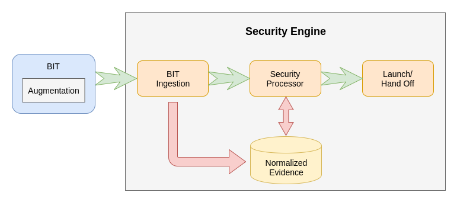

General Architecture
====================

The general execution flow for TrenchBoot is broken into three phases,
Bootstrap Intermediate, and Runtime. The Bootstrap phase primarily consists of
the existing bootstrap technology, e.g. UEFI, grub, UEFI shim, etc. For
TrenchBoot the bootstrap technologies that have an integrity function, referred
to as a Boot Integrity Technology (BIT), are of primary interest. The
Intermediate phase is that which the TrenchBoot Loader executes to establish
the launch integrity of the system. The last phase is the Runtime phase and is
the phase in which the target runtime, hypervisor, operating system, etc, is
given control over the system.

# TrenchBoot Security Engine

At the heart of the TrenchBoot Loader is the TrenchBoot Security Engine.  The
Security Engine is responsible for processing any evidence collected by the
BITs, collect new evidence as needed, evaluate all evidence according to
security policy, and execute appropriate enforcement actions. The components
that enable this and their relationship can be seen in the top level diagram
below.

## Evidence

A core concept in TrenchBoot is that of evidence. For TrenchBoot, evidence is a
record of an event that occurred within the system. The typical form for these
records is a cryptographic hash of system state that was the result of this
event. This cryptographic hash is often referred to as a measurement.

## Boot Integrity Technology

A Boot Integrity Technology (BIT) are software or hardware capabilities that are
responsible for a portion of system launch. Specifically these capabilities
attempt to establish and/or enforce a degree of integrity that the correct
logic was used to launch the system.

## BIT Augmentation

There may be BITs that may need to directly or indirectly extended them to
enable or enhance their usage for launching a TrenchBoot environment.

## BIT Ingestion

A TrenchBoot Security Engine must be capable of supporting a variety of evidence
formats for the various BITs supported. The basis for supporting this is that
TrenchBoot maintains normalized data structures for evidence collected. This
allows the functionality in Security Processor to only have to reason about
normalized data without specialized logic for different data formats.

## Security Processor

At the heart of a TrenchBoot Security Engine is the Security Processor. The
Security Processor consist of the logical components that will consume a launch
policy and take one or more actions to evaluate the state of the system
necessary to enforce the policy. This may include but not limited to collecting
additional evidence, making attestation assertions, encryption key retrieval,
and file/block/drive decryption. The enforcement of the security policy will
result in a full, partial, or failed boot of the system.

## Launch/Hand Off

Ultimately TrenchBoot's responsibility is to launch a target environment. As
such it must be equipped with the various ways required to launch those target
environments.
