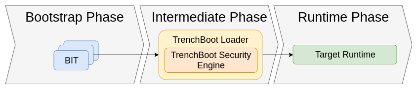

# Background Info

## What is Trust?

Trust is when the computer does something on our behalf we have to trust it
with our data. A trusted component is that which always behaves in an expected
manner.  To make a component "trusted", you must establish some root of trust.
A Root of Trust Measurement is the process of measuring (hashing) components on
a system to validate their integrity. When establishing a root of trust, there
are two primary schools of thought: Static Root of Trust Measurements and
Dynamic Root of Trust Measurements.

## SRTM

SRTM takes place at system boot from firmware / bios. This process requires
measurements of the entire boot sequence at once. This is both a good and a
bad thing, because any changes to any part of the process (including even
bios settings) would cause the entire system to need to be remeasured. SRTM
Starts with Core Root of Trust (CRTM), and works its way up the chain where
each link verifies the next. In other words, SRTM starts by measuring the bios
boot block and then moves on to measure the rest of the bios. 

## DRTM

DRTM aims to address shortcomings of SRTM. DRTM creates trusted environment from
an untrusted state. Essentially what this means is that regardless of weather
or not computer was booted from trusted software, it uses hardware to ensure
that no malicious software has been run. For this reason, DRTM takes place
after boot, as opposed to SRTM, which takes place pre-boot. Intel's solution
for DRTM is TXT, which utilizes special instructions on the processor (SMX).
AMD's solution for DRTM is called SVM. Trenchboot provides a solution for
setting up DRTM for an arbitrary platform

## Typical Measured Launch Process

The process for carrying out DTRM depends on your system.
[Intel TXT Spec](
    https://software.intel.com/content/www/us/en/develop/articles/intel-trusted-execution-technology-intel-txt-enabling-guide.html)
[AMD SVM Spec](https://www.amd.com/system/files/TechDocs/24593.pdf)

## Why TrenchBoot?

- Managing each of these components individually can be confusing
- Most DTRM systems are platform dependent
- Most DTRM systems can only measure what was loaded into memory with it at the
    time it was started
- Most DTRM systems support only one attestation action


# TrenchBoot Architecture

## Architecture Overview

*The full architecture overview can be found at 
[trenchboot.org](trenchboot.org/Theory/Architecture)*

This diagram shows a general overview of the overall architecture of a
TrenchBoot system. In Bootstrap phase the system environment is measured and
that information stored in the dynamic PCRs, using whatever method is
appropriate for the given hardware. The intermediate phase analyzes the
information collected in the bootstrap phase to decide if it wants to continue
booting and pass control to the target OS, or if it wants to stop immediately.
If desired, additional evidence/measurements can be gathered in this phase. Once
 the integrity of the system is verified the TrenchBoot kernel passes off
 control to the actual desired OS to initiate the runtime phase.

## Bootstrap Phase - GRUB

Typically, when attempting to establish a DRTM, TBoot is loaded in order to
carry out TXT on Intel, or SEV is used on AMD. TrenchBoot instead utilizes its
own system, which is a custom version of GRUB that has commands built in to
carry out a TrenchBoot "Secure Launch". This customized grub introduces the
slaunch and slaunch_module commands. A working example of the TrenchBoot GRUB
can be found at
[https://github.com/3mdeb/meta-trenchboot](
    https://github.com/3mdeb/meta-trenchboot).
The custom GRUB is however unfinished and while it is running on AMD, it is not
yet functional with Intel processors.

## Intermediate Phase - Linux Kernel / U-ROOT (Initramfs)
The intermediate phase processes information collected in the bootstrap phase
and converts it into normalized data. This data is eventually used to determine
whether to boot into the target OS. The kernel and u-root initramfs
together make up Trenchboot's "Security Engine", which is an intermediate
mini-OS that serves to process data gathered by that bootstrap phase. During the
intermediate phase, the kernel and initramfs work together to measure block
devices, individual files, SMBUS/DMI information and provides unseal based,
external device and network based attestation. Trenchboot calls this
functionality secure launch (aka slaunch). The table in section 4 lists the
specific repo and branch to use when building the kernel or u-root.

# Practical usage

## Trenchboot GRUB TXT Config with Serial Communication

*Note: ACM modules can be downloaded from
http://mirror.openxt.org/*

```text
    menuentry 'TrenchBoot' {
            savedefault
            load_video
            set gfxpayload=keep
            insmod gzio
            insmod part_msdos
            insmod ext2
            set root='hd0,msdos1'
            multiboot2 /boot/slboot.gz loglvl=all serial=115200,8n1,0x3f8 logging=serial,memory
            module2 /boot/vmlinuz-trenchboot root=UUID=<your block uuid> ro intel_iommu=on loglevel=7 console=ttyS0,115200 nokaslr 
            module2 /boot/<your acm>.bin
            module2 /boot/initramfs-trenchboot.cpio
    }
```

## Testing the System

QEMU has been tested to boot fully into u-root while simulating the Trenchboot
kernel. 
QEMU For external u-root

```bash
qemu-systemx86_64 -kernel <kernel repo>/arch/x86/boot/bzImage -initrd /tmp/initramfs.linux_amd64.cpio -append console=ttyS0,38400 -serial file:serial.out
```

QEMU with u-root built-in

```bash
qemu-systemx86_64 -kernel <kernel location>
```

# State of TrenchBoot

| Name | Purpose | Functionality | Repo
|----------|-----|---|---|
| Linux       | Kernel | The custom TrenchBoot linux kernel does include working code that allows u-root to function properly. This kernel also functions as a regular kernel in that when it is launched without SLBoot, the data required to begin the measured launch process is simply not exposed.   | link: [here](https://github.com/TrenchBoot/linux) working branch: linux-sl-5.5
| U-root | initramfs/initrd  | By default launching u-root should show “u-root” in big bubble letters along with a shell. The u-root the command to launch into a MLE is sluinit which can be configured to be called automatically. | link: [here](https://github.com/TrenchBoot/u-root/) working branch: for-upstream
| Grub | *experimental built-in* secure multiboot preboot module  |  The custom GRUB seems to be unfinished but soon aims to implement the slaunch and slaunch_module commands. | link: [here](https://github.com/TrenchBoot/grub) working branch: trenchboot_support_2.04

# Various GitHub and further documentation links
- (AMD only project), contains TrenchBoot working custom GRUB and u-root
with tpm2 tools 3mdeb, meta-trenchboot (2020, April 17) &ndash;
    https://github.com/3mdeb/meta-trenchboot

- LKML Trenchboot doc
Philipson, R. (2020, March 25) 	[RFC PATCH 00/12] x86: *Trenchboot secure late
launch Linux kernel support* &ndash;
    https://lkml.org/lkml/2020/3/25/982

- TrenchBoot informative talk
The Linux Foundation. (2019, October 1). *TrenchBoot - How to Nicely Boot System
with Intel TXT and AMD SVM* &ndash;
    https://www.youtube.com/watch?v=DbpCU9iSi4g
