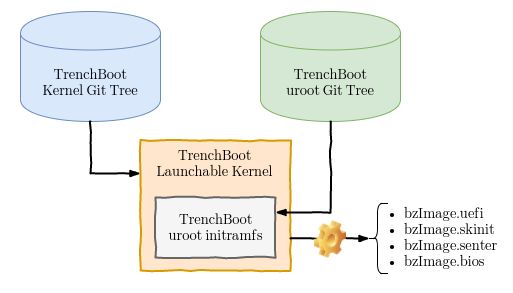

Developers Guide
================

TrenchBoot is a framework that provides for users the ability to select the
kernel and security engine components appropriate for their target environment.
This developers guide focuses on the software components of TrenchBoot and the
build system used to compose TrenchBoot launchable images.

## TrenchBoot Linux/uroot Configuration

A TrenchBoot launchable image consists of a TrenchBoot Linux kernel with a
TrenchBoot uroot initramfs embedded within the image. When building for a target,
the boot capabilities and BITs that will be supported will result in different
launchable images. The diagram below provides a simple visual depiction of this
setup.

As a result of the build process, one or more kernel images may be generated.
By convention these kernels will be labeled as such:

* bzImage.uefi: An image built to be launch by a UEFI environment
* bzImage.skinit: An image built to be launched with AMD's SKINIT instruction
* bzImage.senter: An image built to be launched with Intel's SENTER instruction
* bzImage.bios: An image build to be launched by a legacy BIOS boot loader
