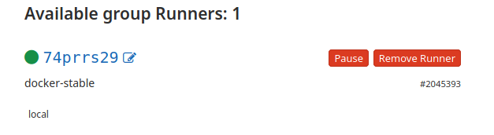

# Running

Use `docker-compose` script from the [trenchboot-ci](https://github.com/3mdeb/trenchboot-ci/tree/master/gitlab-runner)
repository:

```bash
docker-compose up
```

On first run you will see there is no config file:

```
gitlab-runner1_1  | ERROR: Failed to load config stat /etc/gitlab-runner/config.toml: no such file or directory  builds=0
gitlab-runner1_1  | ERROR: Failed to load config stat /etc/gitlab-runner/config.toml: no such file or directory  builds=0
```

You need to perform the [registration](#register).

# Registration

1. Go to [CI/CD](https://gitlab.com/groups/trenchboot1/-/settings/ci_cd) settings
   in your group.

1. Go to the `Set up a group Runner manually` section and set the
   `registration token` as environmental variable:

   ```bash
   export REGISTRATION_TOKEN="QZgfyepK2_t3SshRgX2K"
   ```

1. Register using the [script](https://github.com/3mdeb/trenchboot-ci/blob/master/gitlab-runner/gitlab-runner-register.sh):

   ```bash
   ./gitlab-runner-register.sh

   Runtime platform                                    arch=amd64 os=linux pid=142 revision=ce065b93 version=12.10.1
   Running in system-mode.

   Registering runner... succeeded                     runner=QZgfyepK
   Runner registered successfully. Feel free to start it, but if it's running already the config should be automatically reloaded!
   ```

1. The containter logs should become:

   ```
   gitlab-runner1_1  | Configuration loaded                                builds=0
   ```

1. The runner should be available in the
   [CI/CD group settings](https://gitlab.com/groups/trenchboot1/-/settings/ci_cd#runners-settings)

   

1. Refer to the
   [register documentation](https://docs.gitlab.com/runner/register/index.html)
   if needed.

# Usage

Local runner can run the exact same jobs as a shared runnners in the cloud.
Typically, we will want to mark some specific jobs to run on the local runner
instead. Examples of such jobs:
- local infastructure acces required,
- extensive hardware requirementes (shared runners have limited resources).

In the [gitlab-runner-register.sh](https://github.com/3mdeb/trenchboot-ci/blob/master/gitlab-runner/gitlab-runner-register.sh)
we are providing a list of tags as one of the arguments:

```bash
--tag-list local \
```

In this case, we mark our runner with a `local` tag. We can mark a specific job
(in a `.gitlab-ci.yml` file) with the same tag, to make sure it will always run
on a local runner, rather the shared (cloud one). The syntax is:

```bash
  tags:
    - local
```

Please refer to the
[tags description in the official documentation](https://docs.gitlab.com/ee/ci/yaml/#tags).
